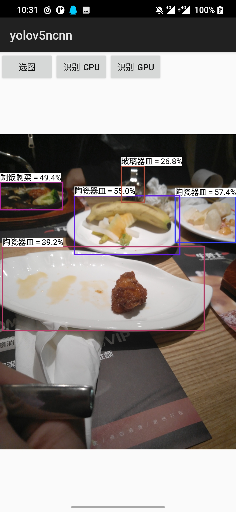
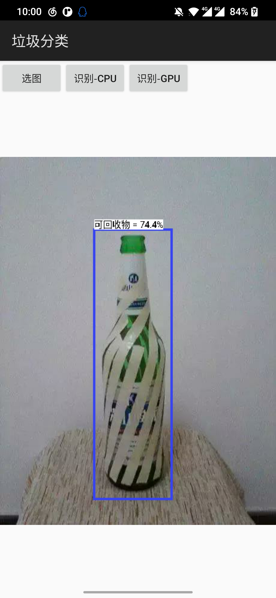

### 写于10.28

#### 目前进度：完成yolov5的模型训练，并且部署在Android端。
模型上传在百度云，需要放在 app/src/main/assets 中：
链接：https://pan.baidu.com/s/1OiDJ0UKkzqrL6vgGVIoPuA 
提取码：d02f

下图是目前实现的效果。

<figure>

<figure/>

#### TODO

目前项目的内容还比较简陋。还有很多需要完善的地方，目前能够想到的问题如下。

1. 目前实现的垃圾识别都是基于一个垃圾独立的数据集，都是“一个一个的垃圾”，而不是“一堆垃圾”，在大场景下（如街道摄像头视角，丛林视角）进行的垃圾识别。模型适用的范围有所欠缺。所以之后可以找找看有没有相关的数据集进行训练。
2. app还是比较简陋，打算使用flutter进行美化，但是在flutter项目中进行使用ncnn框架调用c++代码又是一个问题。
3. 如果能够不只是部署在手机端，能够部署到树莓派这样的平台上，装在垃圾桶上实现一种能够提醒人们进行分类的智能垃圾桶就更好了。
4. 能不能在单纯垃圾分类之上拓展功能。
